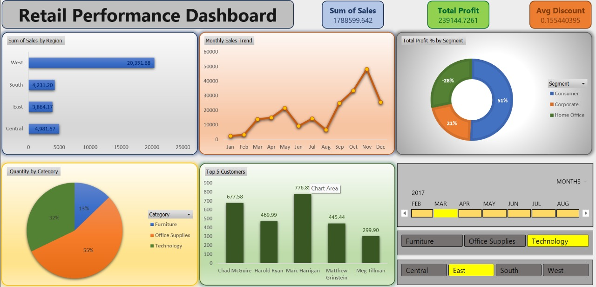

# Excel-Retail-Sales-Dashboard-project

  ✅ Power Query for data cleaning
  ✅ Pivot Tables for aggregations
  ✅ Slicers, Timeline and Charts for dynamic filtering and visualization

## 📝 Skills Demonstrated:
  - Data Cleaning
  - KPI Visualization
  - Charting and Dashboard Design

## 📂 File:
  - `Dashboard project.xlsx`: Main project file

## 📸 Dashboard Preview 👇:
  

## 📧 Contact:
  Connect with me on [LinkedIn](https://www.linkedin.com/in/chirag-gothankar-7902a9330/) or reach out for collaboration!  
